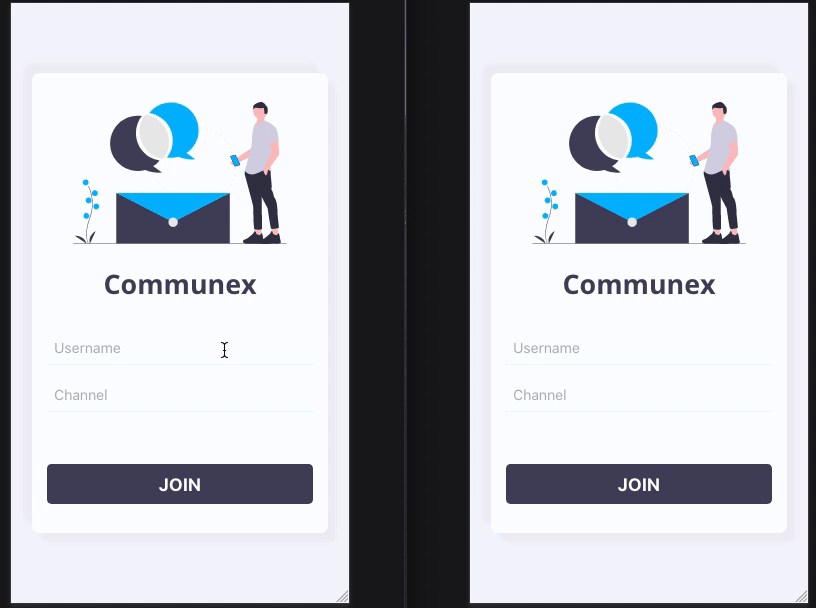

# Communex ✅ READY TO GRADE

## Simple instant messaging application using React, Socket.io and Express

### Client side

Tools and technology

- React with React router dom
- Socket.io Client
- Styled Components

How to run the appication

- clone the repository `cd communex/client`
- `npm install` - install dependencies
- `npm start` or `yarn start` - to start the app
- `npm run buil` or `yarn build` - prod build

### Server side

Tools and technology

- Node.js
- Express.js
- Socket.io
- Http server + nodemon

How to run the application

- clone the repository `cd communex/server`
- `npm install` - install dependencies
- `npm start` or `nodemon index.js` - to start the app
